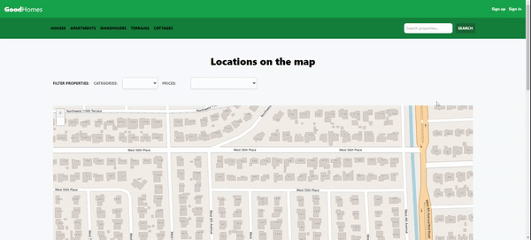

<a name="readme-top"></a>

<!-- PROJECT LOGO -->
<br />
<div align="center">
    <svg xmlns="http://www.w3.org/2000/svg" viewBox="0 0 24 24" fill="currentColor" style="width: 50px">
        <path d="M11.47 3.841a.75.75 0 0 1 1.06 0l8.69 8.69a.75.75 0 1 0 1.06-1.061l-8.689-8.69a2.25 2.25 0 0 0-3.182 0l-8.69 8.69a.75.75 0 1 0 1.061 1.06l8.69-8.689Z" />
        <path d="m12 5.432 8.159 8.159c.03.03.06.058.091.086v6.198c0 1.035-.84 1.875-1.875 1.875H15a.75.75 0 0 1-.75-.75v-4.5a.75.75 0 0 0-.75-.75h-3a.75.75 0 0 0-.75.75V21a.75.75 0 0 1-.75.75H5.625a1.875 1.875 0 0 1-1.875-1.875v-6.198a2.29 2.29 0 0 0 .091-.086L12 5.432Z" />
    </svg>

<h1>Good<b>Homes</b></h1>
<h3 align="center">goodhomes-nodejs</h3>
  <p align="center">
    A real property monolitic web application made on an Udemy course
    <br />
  </p>
</div>


<!-- TABLE OF CONTENTS -->
<details>
  <summary>Table of Contents</summary>
  <ol>
    <li>
      <a href="#about-the-project">About The Project</a>
      <ul>
        <li><a href="#built-with">Built With</a></li>
      </ul>
    </li>
    <li>
      <a href="#getting-started">Getting Started</a>
      <ul>
        <li><a href="#prerequisites">Prerequisites</a></li>
        <li><a href="#installation">Installation</a></li>
      </ul>
    </li>
    <li><a href="#usage">Usage</a></li>
    <li><a href="#contact">Contact</a></li>
  </ol>
</details>


<!-- ABOUT THE PROJECT -->
## About The Project
<div align="center">
    
</div>


This is a monolitic web application made on an Udemy course of Node.js. It has a lot of features and custom changes that i made as a hamburguer button which toggles a lateral menu for mobile devices and custom color design along with other design modifications on the views. 

Said Udemy course is in Spanish, but i coded the project in English so it can be checked out more internationally.

The project has the following features:

* Sign in and sign up
    * Recover your password sytem
    * Verification through email system
* View, Upload, modify and delete a property
    * Upload an image of a property
    * Set the address of the property pointing it through a map (leaflet)
    * Search of properties through text 
    * Search of properties by the home view map which includes filters by category and price
* Message the owner of the property
* Desktop and mobile compatibility (responsive)
* CSRF protection
* Encrypted user token through JWT


<p align="right">(<a href="#readme-top">back to top</a>)</p>


### Built With

* ![Node][NodeJS-logo]
* ![JavaScript][JavaScript-logo]
* ![Nodemon][Nodemon-logo]
* ![Sequelize][Sequelize-logo]
* ![Express.js][Express.js-logo]
* ![MySQL][MySQL-logo]
* ![TailwindCSS][TailwindCSS-logo]
* ![Webpack][Webpack-logo]
* ![Pug][Pug-logo]
* ![JWT][JWT-logo]

<p align="right">(<a href="#readme-top">back to top</a>)</p>


<!-- GETTING STARTED -->
## Getting Started

To get a local copy up and running follow these simple example steps.

### Prerequisites

* SMTP Server (to handle email confirmation and lost password systems)
* MySQL database
* Node.js
* Git (in case you want to clone the project)

### Installation

1. Clone the repo
   ```sh
   git clone https://github.com/EmRodDev/goodhomes-nodejs
   ```
2. Install NPM packages
   ```sh
   npm install
   ```
3. Create an `.env` file on the project's root folder with the following environment variables:
   ```env
    DB_NAME=
    DB_USER=
    DB_PASS=
    DB_HOST=
    DB_PORT=

    EMAIL_HOST=
    EMAIL_PORT=
    EMAIL_USER=
    EMAIL_PASS=

    BACKEND_URL=
    BACKEND_PORT=

    JWT_SECRET=
   ```

<p align="right">(<a href="#readme-top">back to top</a>)</p>


<!-- USAGE EXAMPLES -->
## Usage

For development, this project needs to run two commands on separate command line clients in order to use it properly:

1. The first command is to start the server
   ```sh
   npm run server
   ```
2. The second command is to render all the Tailwind and Webpack styles and scripts
   ```sh
   npm run dev
   ```
3. (Optional) If you only want to see how the project behaves with already existing data, you can use the following command to import some example data on `Categories`, `Prices` and `User` tables
   ```sh
   npm run db:import
   ```

<p align="right">(<a href="#readme-top">back to top</a>)</p>

<!-- CONTACT -->
## Contact

[![Linkedin][LinkedIn-logo]][linkedin-url]


<p align="right">(<a href="#readme-top">back to top</a>)</p>


<!-- LOGOS -->
[LinkedIn-logo]: https://img.shields.io/badge/linkedin-%230077B5.svg?style=for-the-badge&logo=linkedin&logoColor=white
[NodeJS-logo]: https://img.shields.io/badge/node.js-6DA55F?style=for-the-badge&logo=node.js&logoColor=white
[Nodemon-logo]: https://img.shields.io/badge/NODEMON-%23323330.svg?style=for-the-badge&logo=nodemon&logoColor=%BBDEAD
[Express.js-logo]: https://img.shields.io/badge/express.js-%23404d59.svg?style=for-the-badge&logo=express&logoColor=%2361DAFB
[MySQL-logo]: https://img.shields.io/badge/mysql-%2300f.svg?style=for-the-badge&logo=mysql&logoColor=white
[TailwindCSS-logo]: https://img.shields.io/badge/tailwindcss-%2338B2AC.svg?style=for-the-badge&logo=tailwind-css&logoColor=white
[Webpack-logo]: https://img.shields.io/badge/webpack-%238DD6F9.svg?style=for-the-badge&logo=webpack&logoColor=black
[Pug-logo]: https://img.shields.io/badge/Pug-FFF?style=for-the-badge&logo=pug&logoColor=A86454
[JWT-logo]: https://img.shields.io/badge/JWT-black?style=for-the-badge&logo=JSON%20web%20tokens
[Sequelize-logo]: https://img.shields.io/badge/Sequelize-52B0E7?style=for-the-badge&logo=Sequelize&logoColor=white
[JavaScript-logo]: https://img.shields.io/badge/javascript-%23323330.svg?style=for-the-badge&logo=javascript&logoColor=%23F7DF1E

<!-- URLS -->
[linkedin-url]: https://www.linkedin.com/in/erodriguezarr/
[product-screenshot]: screenshot/screenshot.gif
